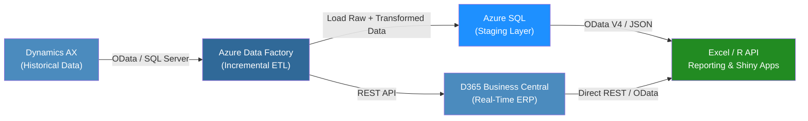

# 🤩 Aeristo Data Integration Case Study & Proposal

## 📌 Summary

This document presents a **cost-effective and scalable ETL and data integration strategy** for Aeristo, a luxury leather goods company specializing in bespoke interiors for luxury automobiles and private aircraft (e.g., G6, G7). The objective is to integrate legacy data from **Microsoft Dynamics AX (pre-2023)** with **Microsoft Dynamics 365 Business Central (current live data)** and ensure future compatibility with Excel-based reporting, R, and RShiny applications for real-time analytics.

---

## 📚 Table of Contents

1. [Business Problem](#business-problem)
2. [Technical Overview](#technical-overview)
3. [ETL Strategy & Middleware](#etl-strategy--middleware)
4. [Integration Workflow Diagram](#integration-workflow-diagram)
5. [Data Consumption for Reporting](#data-consumption-for-reporting)
6. [Compatible APIs for R & RShiny](#compatible-apis-for-r--rshiny)
7. [Tech Stack](#tech-stack)
8. [Conclusion](#conclusion)

---

## 🧭 Business Problem

Aeristo operates two parallel systems:

* **Microsoft Dynamics AX**: Legacy system used pre-2023 for **customer/vendor records, historical sales, and purchasing history**.
* **Microsoft D365 Business Central**: Current real-time ERP system, source of operational truth post-2023.

**Key Challenge**: These systems do not communicate, limiting data-driven decision-making and report creation.

---

## ⚙️ Technical Overview

We propose an **ETL pipeline** that will:

* Extract historical data from Dynamics AX
* Transform it into schema-aligned format for Business Central
* Load it incrementally (not one-swoop due to system load concerns)

Additionally, we will **expose API endpoints** for:

* R & RShiny dashboards
* Excel-based reporting

---

## 🛠️ ETL Strategy & Middleware

### 🔄 ETL Process (Incremental)

1. **Extract**: AX data via SQL Server or OData
2. **Transform**: Schema conversion, date alignment, metadata tagging
3. **Load**: To Business Central via APIs or intermediary Azure SQL DB

### 🧍️‍⚖️ Middleware: Azure Data Factory

* **Cost-effective, low-code cloud ETL tool**
* Native connectors for Dynamics AX, D365 BC, Azure SQL, Excel
* Supports **incremental loads, scheduling, and logging**

### ✅ Benefits

* No local infrastructure needed
* Compatible with Excel/Power Query
* Governed via Azure Security & Logging

---

## 🧬 Integration Workflow Diagram

### 🔍 Executive Overview

This diagram illustrates how Aeristo's historical and live business data will be seamlessly connected, allowing for enterprise-grade reporting and data visibility across departments.

**Here’s how each component works:**

* **Dynamics AX (Historical Data)**: This is where Aeristo’s customer, vendor, sales, and purchasing history lived before 2023. While it's no longer the active system, this data is too valuable to discard.

* **Azure Data Factory**: Think of this as the data pipeline. It smartly extracts the data from AX, transforms it so it looks like the current system’s format, and loads it where it’s needed. It does this in small batches, so there's no disruption to your operations.

* **D365 Business Central (Live ERP)**: This is the heart of Aeristo’s day-to-day business. Once transformed, the historical data lands here and is blended with your current data, enabling complete visibility for leadership, sales, and finance teams.

* **Azure SQL (Staging Layer)**: This acts like a temporary holding pen. It’s useful for testing and cleaning up data before it reaches Business Central, or for storing specific reports.

* **Excel / R API Reporting**: This is where the value becomes visible. Whether a manager prefers Excel or your data scientists work in R and Shiny, both teams will have real-time access to updated data for decision-making, forecasting, and dashboard creation.

> *This diagram visualizes the incremental data integration workflow across Dynamics AX, Azure Data Factory, Business Central, Azure SQL, and API-driven reporting layers.*

---

## 📊 Data Consumption for Reporting

* **Excel**: Power Query connects to either Azure SQL Staging or Business Central OData feeds
* **R / RShiny**: Consumes Business Central data via OData V4 API or REST endpoints

---

## 📱 Compatible APIs for R & RShiny

### 🔗 OData V4

* Native to D365 BC
* Easy integration with `httr`, `tidyverse`, or `RODBC`

### 🔗 REST APIs

* For more complex authentication scenarios (OAuth 2.0)
* Supports `httr::GET()` and `jsonlite::fromJSON()` for dashboard ingestion

### 🔗 R Packages

---

## 💻 Tech Stack

### 🔧 Microsoft Dynamics AX

### 🔧 Microsoft Dynamics 365 Business Central

### 🔧 Middleware & Cloud Tools

---

## 📾 Conclusion

The proposed solution uses **Azure Data Factory** to perform **incremental ETL operations** from Microsoft Dynamics AX into Business Central using schema-aligned transformations and staging via Azure SQL. This allows Aeristo to unify historical and live data without disrupting current operations.

Once in place, this pipeline enables real-time reporting via **Excel**, **R**, and **RShiny**, leveraging **OData V4 and REST APIs** directly from Business Central. The architecture is cloud-based, **scalable, secure, and designed to minimize infrastructure costs**.

---

> ✅ This proposal is designed for executive decision-makers, senior data engineers, and software architects. It ensures enterprise scalability and developer-friendly tools without compromising cost-efficiency or compatibility with modern data science stacks.

