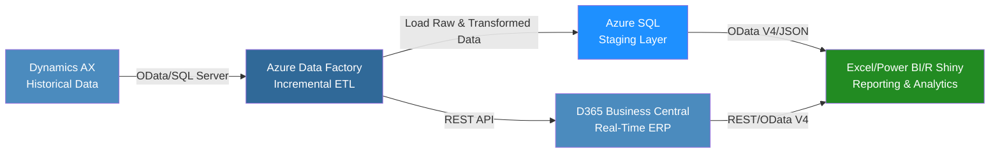

# 🌟 Aeristo Data Integration Case Study & Phased Implementation Plan

---

## 📌 Summary

This document outlines a modern, scalable ETL and data integration strategy for Aeristo, a Dallas-based luxury leather goods company specializing in bespoke interiors for high-end automobiles and private aircraft (e.g., Gulfstream G6, G7). The goal is to integrate legacy data from Microsoft Dynamics AX (pre-2023) with Microsoft Dynamics 365 Business Central (current live data), enabling real-time analytics through Excel, Power BI, and R Shiny applications. The project is structured in three phases—data integration and ETL pipeline setup, reporting and dashboard development, and ongoing optimization—delivering a cloud-native, secure solution as of June 2025.

---

## 📚 Table of Contents

* [Business Problem](#business-problem)
* [Technical Overview](#technical-overview)
* [ETL Strategy & Middleware](#etl-strategy--middleware)
* [Integration Workflow Diagram](#integration-workflow-diagram)
* [Data Consumption for Reporting](#data-consumption-for-reporting)
* [Lightweight Local Storage Option: SQLite](#lightweight-local-storage-option-sqlite)
* [Compatible APIs for R & R Shiny](#compatible-apis-for-r--r-shiny)
* [Phased Implementation Plan](#phased-implementation-plan)
  * [Phase 1: Data Integration and ETL Pipeline Setup](#phase-1-data-integration-and-etl-pipeline-setup)
  * [Phase 2: Reporting and Dashboard Development](#phase-2-reporting-and-dashboard-development)
  * [Phase 3: Optimization and Maintenance](#phase-3-optimization-and-maintenance)
* [Estimated Tooling Costs](#estimated-tooling-costs)
* [Tech Stack](#tech-stack)
* [Conclusion](#conclusion)

---

## 💻 Tech Stack

### 🔧 Microsoft Dynamics AX


### 🔧 Microsoft Dynamics 365 Business Central


### 🔧 Middleware & Cloud Tools


### 🔧 Analytics & Reporting


### 🔧 R Packages


---

## 📊 Integration Workflow Diagram



This diagram renders correctly in GitHub Markdown when Mermaid is supported and shows the full ETL flow.

---

## 📊 Data Consumption for Reporting

### 📊 How R Shiny Connects and Adds Value

R Shiny delivers interactive dashboards with advanced analytics capabilities, surpassing Power BI in customization for data scientists.

**Benefits for Aeristo:**

* **Real-Time Data:** Connects to Business Central APIs (REST/OData V4) for live updates.
* **Interactive Dashboards:** Enables filtering of sales, inventory, or vendor trends.
* **Advanced Analytics:** Supports forecasting and segmentation models.
* **Deployment:** Host on Azure or internal servers for secure access.
* **Cost-Effective:** Open-source, no per-user licensing fees.

**Excel/Power BI Integration:** Power Query and Power BI connect to Azure SQL or Business Central OData feeds for user-friendly reports.

---

## 🤷️‍⚖️ Lightweight Local Storage Option: SQLite

For small-scale deployments, limited stakeholders, or localized use-cases, **SQLite** provides a free, file-based, low-maintenance option to store transformed data and enable analytics.

### ✅ Benefits:

* **No setup needed**
* **Works on any OS**
* **No server required**
* **Ideal for 1–3 user Shiny apps**
* **Compatible with `DBI` and `RSQLite` packages**

### 📈 Where It Fits:

In Phase 2 or Phase 3, SQLite can serve as a staging or reporting layer **if** Business Central API usage is cost-prohibitive or real-time sync is unnecessary.

```r
library(DBI)
library(RSQLite)

con <- dbConnect(RSQLite::SQLite(), "aeristo_data.sqlite")
query <- "SELECT * FROM inventory WHERE stock_on_hand < reorder_level"
df <- dbGetQuery(con, query)
dbDisconnect(con)
```
Use this to build R Shiny dashboards offline or in environments with tight budget/security restrictions.

## 🚀 Robust Upgrade Path: Azure SQL or PostgreSQL

If SQLite proves insufficient due to concurrent usage or scalability demands, a natural upgrade path would be **Azure SQL** or **PostgreSQL**.

### 🏋️ Azure SQL
* Fully managed PaaS by Microsoft
* Native integration with Azure ecosystem (e.g., Data Factory, Synapse)
* Scales seamlessly with R Shiny, Power BI, Excel
* Excellent for enterprise-grade R Shiny dashboards

### 🚀 PostgreSQL
* Open-source, robust RDBMS with strong performance under concurrent loads
* Compatible with `RPostgres` and `pool` packages in R
* Works well in Dockerized or on-premise environments

### 🔍 Code Sample (PostgreSQL)

```r
library(DBI)
library(RPostgres)

con <- dbConnect(RPostgres::Postgres(),
  dbname = "aeristo",
  host = "your-host-url",
  port = 5432,
  user = "your_user",
  password = "your_password"
)
df <- dbGetQuery(con, "SELECT * FROM sales WHERE margin < 0.1")
dbDisconnect(con)
```

These options can be implemented during **Phase 2** or **Phase 3** for apps with growing stakeholder access, large datasets, or concurrent real-time usage.

📩 Conclusion
This modernized solution uses Azure Data Factory and Azure Synapse Analytics (optional) to perform incremental ETL operations, integrating Microsoft Dynamics AX with Business Central via Azure SQL staging. The three-phase approach ensures Aeristo unifies historical and live data seamlessly:

Phase 1 delivers a robust data pipeline.
Phase 2 provides actionable insights through Power BI, Excel, and R Shiny dashboards.
Phase 3 guarantees long-term scalability and compliance.
The cloud-native architecture is secure, cost-effective, and scalable—enabling real-time analytics via Excel, Power BI, and R Shiny through OData V4 and REST APIs. Designed for executives, data engineers, and architects, this phased plan supports Aeristo’s modernization and analytics goals for 2025 and beyond.

✅ This case study is optimized for GitHub readability and compatibility with modern cloud-native practices.
---


