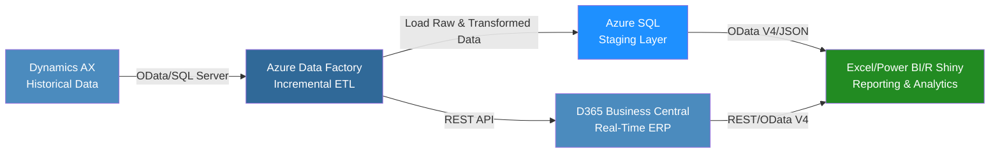

# 🤩 Aeristo Data Integration Case Study & Phased Implementation Plan

---

## 📌 Summary

This document outlines a modern, scalable ETL and data integration strategy for Aeristo, a Dallas-based luxury leather goods company specializing in bespoke interiors for high-end automobiles and private aircraft (e.g., Gulfstream G6, G7). The goal is to integrate legacy data from Microsoft Dynamics AX (pre-2023) with Microsoft Dynamics 365 Business Central (current live data), enabling real-time analytics through Excel, Power BI, and R Shiny applications. The project is structured in three phases—data integration and ETL pipeline setup, reporting and dashboard development, and ongoing optimization—delivering a cloud-native, secure solution as of June 2025.

---

## 📚 Table of Contents

* [Business Problem](#business-problem)
* [Technical Overview](#technical-overview)
* [ETL Strategy & Middleware](#etl-strategy--middleware)
* [Integration Workflow Diagram](#integration-workflow-diagram)
* [Data Consumption for Reporting](#data-consumption-for-reporting)
* [Compatible APIs for R & R Shiny](#compatible-apis-for-r--r-shiny)
* [Phased Implementation Plan](#phased-implementation-plan)
* [Estimated Tooling Costs](#estimated-tooling-costs)
* [Tech Stack](#tech-stack)
* [Conclusion](#conclusion)

---

## 🧭 Business Problem

Aeristo relies on two disconnected systems:

* **Microsoft Dynamics AX**: Legacy ERP (pre-2023) storing customer, vendor, sales, and purchasing history (\~500K records).
* **Microsoft Dynamics 365 Business Central**: Cloud-based ERP for real-time operations post-2023.

**Key Challenge:** The lack of integration between these systems limits Aeristo’s ability to combine historical and live data, hindering data-driven decisions for inventory management, sales forecasting, and customer insights critical to their luxury leather operations.

---

## ⚙️ Technical Overview

The solution leverages a modern ETL pipeline to:

* Extract historical data from Dynamics AX via SQL Server or OData.
* Transform it to align with Business Central’s schema.
* Load it incrementally to minimize system impact.

**API endpoints enable:**

* R Shiny dashboards for advanced analytics (e.g., demand forecasting).
* Power BI and Excel reports for stakeholder accessibility.

The implementation is divided into three phases:

1. **Phase 1:** Data Integration and ETL Pipeline Setup (3-4 months).
2. **Phase 2:** Reporting and Dashboard Development (2-3 months).
3. **Phase 3:** Optimization and Maintenance (ongoing).

---

## 🛠️ ETL Strategy & Middleware

### 🔄 ETL Process (Incremental)

The ETL process unifies historical and live data:

* **Extract:** Retrieve data from Dynamics AX using SQL Server or OData.
* **Transform:** Align schemas, reformat dates, and tag metadata.
* **Load:** Push transformed data to Business Central via APIs or stage in Azure SQL Database.

### 🧍️‍⚖️ Middleware: Azure Data Factory

* Low-code, cloud-native ETL platform with native connectors.
* Supports incremental loads, automated scheduling, and logging.
* Optional Azure Synapse Analytics integration for advanced transformation.

### ✅ Benefits

* **Cloud-native**: Eliminates on-premises infrastructure.
* **Reporting-ready**: Compatible with Power BI, Excel, and R Shiny.
* **Secure**: Governed by Azure Security Center.

---

## 🛠️ Phase 1: Data Integration and ETL Pipeline Setup

***Estimated Timeframe:** 3-4 months*

### **Tasks Involved:**

* **Assess Data Sources:** Map schemas and evaluate quality.
* **Configure Azure Data Factory (ADF):** Setup incremental load pipelines.
* **Set Up Azure SQL Staging Layer:** Clean and validate data.
* **Develop ETL Pipeline:** Execute extract, transform, load.
* **Test and Validate:** Pilot loads and diagnostics.
* **Enable API Access:** Publish OData/REST APIs for reporting.

### **Phase 1 Tech Stack**

### **Phase 1 R Packages**

---

## 🧬 Integration Workflow Diagram

This diagram renders correctly in GitHub Markdown when Mermaid is supported and shows the full ETL flow.

---

## 📊 Data Consumption for Reporting

* **Excel/Power BI**: Pulls data from Azure SQL and OData feeds.
* **R Shiny**: Provides custom interactive dashboards with API-based real-time data.

*See original document for code snippets and R dashboard examples.*

---

## 💻 Tech Stack

---

## ✅ Conclusion

This GitHub-optimized plan offers a realistic roadmap for integrating legacy and real-time ERP systems using Azure cloud tools and modern APIs. Each component is modular, scalable, and compliant with enterprise standards for security, performance, and real-time insights.

By combining open-source tools (like R Shiny) and Microsoft’s cloud stack, Aeristo can unify its operational and historical data while keeping long-term costs low and scalability high.

