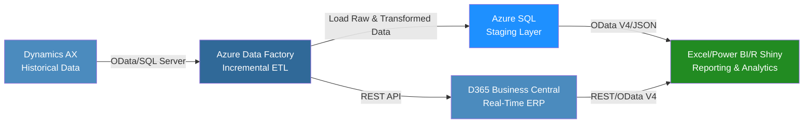

# 🤩 Aeristo Data Integration Case Study & Phased Implementation Plan

---

## 📌 Summary

This document outlines a modern, scalable ETL and data integration strategy for Aeristo, a Dallas-based luxury leather goods company specializing in bespoke interiors for high-end automobiles and private aircraft (e.g., Gulfstream G6, G7). The goal is to integrate legacy data from Microsoft Dynamics AX (pre-2023) with Microsoft Dynamics 365 Business Central (current live data), enabling real-time analytics through Excel, Power BI, and R Shiny applications. The project is structured in three phases—data integration and ETL pipeline setup, reporting and dashboard development, and ongoing optimization—delivering a cloud-native, secure solution as of June 2025.

---

## 📚 Table of Contents

* [Business Problem](#business-problem)
* [Technical Overview](#technical-overview)
* [ETL Strategy & Middleware](#etl-strategy--middleware)
* [Integration Workflow Diagram](#integration-workflow-diagram)
* [Data Consumption for Reporting](#data-consumption-for-reporting)
* [Compatible APIs for R & R Shiny](#compatible-apis-for-r--r-shiny)
* [Phased Implementation Plan](#phased-implementation-plan)

  * [Phase 1: Data Integration and ETL Pipeline Setup](#phase-1-data-integration-and-etl-pipeline-setup)
  * [Phase 2: Reporting and Dashboard Development](#phase-2-reporting-and-dashboard-development)
  * [Phase 3: Optimization and Maintenance](#phase-3-optimization-and-maintenance)
* [Estimated Tooling Costs](#estimated-tooling-costs)
* [Tech Stack](#tech-stack)
* [Conclusion](#conclusion)

---

## 🧭 Business Problem

Aeristo relies on two disconnected systems:

* **Microsoft Dynamics AX**: Legacy ERP (pre-2023) storing customer, vendor, sales, and purchasing history (\~500K records).
* **Microsoft Dynamics 365 Business Central**: Cloud-based ERP for real-time operations post-2023.

**Key Challenge:** The lack of integration between these systems limits Aeristo’s ability to combine historical and live data, hindering data-driven decisions for inventory management, sales forecasting, and customer insights critical to their luxury leather operations.

---

## ⚙️ Technical Overview

The solution leverages a modern ETL pipeline to:

* Extract historical data from Dynamics AX via SQL Server or OData.
* Transform it to align with Business Central’s schema.
* Load it incrementally to minimize system impact.

**API endpoints enable:**

* R Shiny dashboards for advanced analytics (e.g., demand forecasting).
* Power BI and Excel reports for stakeholder accessibility.

The implementation is divided into three phases:

1. **Phase 1:** Data Integration and ETL Pipeline Setup (3-4 months).
2. **Phase 2:** Reporting and Dashboard Development (2-3 months).
3. **Phase 3:** Optimization and Maintenance (ongoing).

---

## 🛠️ ETL Strategy & Middleware

### 🔄 ETL Process (Incremental)

The ETL process unifies historical and live data:

* **Extract:** Retrieve data from Dynamics AX using SQL Server or OData.
* **Transform:** Align schemas, reformat dates, and tag metadata.
* **Load:** Push transformed data to Business Central via APIs or stage in Azure SQL Database.

### 🧍️‍⚖️ Middleware: Azure Data Factory

* Low-code, cloud-native ETL platform with native connectors.
* Supports incremental loads, automated scheduling, and logging.
* Optional Azure Synapse Analytics integration for advanced transformation.

### ✅ Benefits

* **Cloud-native**: Eliminates on-premises infrastructure.
* **Reporting-ready**: Compatible with Power BI, Excel, and R Shiny.
* **Secure**: Governed by Azure Security Center.

---

## 🛠️ Phase 1: Data Integration and ETL Pipeline Setup

***Estimated Timeframe:** 3-4 months*

### **Tasks Involved:**

* **Assess Data Sources:** Map schemas and evaluate quality.
* **Configure Azure Data Factory (ADF):** Setup incremental load pipelines.
* **Set Up Azure SQL Staging Layer:** Clean and validate data.
* **Develop ETL Pipeline:** Execute extract, transform, load.
* **Test and Validate:** Pilot loads and diagnostics.
* **Enable API Access:** Publish OData/REST APIs for reporting.

### **Phase 1 Tech Stack**


### **Phase 1 R Packages**


---

## 🧬 Integration Workflow Diagram



This diagram renders correctly in GitHub Markdown when Mermaid is supported and shows the full ETL flow.

---

## 📊 Data Consumption for Reporting

### 📊 How R Shiny Connects and Adds Value

R Shiny delivers interactive dashboards with advanced analytics capabilities, surpassing Power BI in customization for data scientists.

**Benefits for Aeristo:**

* **Real-Time Data:** Connects to Business Central APIs (REST/OData V4) for live updates.
* **Interactive Dashboards:** Enables filtering of sales, inventory, or vendor trends.
* **Advanced Analytics:** Supports forecasting and segmentation models.
* **Deployment:** Host on Azure or internal servers for secure access.
* **Cost-Effective:** Open-source, no per-user licensing fees.

**Excel/Power BI Integration:** Power Query and Power BI connect to Azure SQL or Business Central OData feeds for user-friendly reports.

---

## 🛠️ Phase 2: Reporting and Dashboard Development

***Estimated Timeframe:** 2-3 months (8–12 weeks)*

### **Tasks Involved:**

* **Design Reporting Requirements:** Define KPIs, stakeholder needs.
* **Build Power BI Dashboards:** Inventory, sales, vendor performance.
* **Develop Excel Reports:** Connect to Azure SQL/Business Central.
* **Create R Shiny Dashboards:** Forecasting, visual apps.
* **Validate Reports:** Accuracy checks, query performance tuning.

### **Example: R Shiny Inventory Dashboard**

```r
# R Shiny dashboard code omitted for brevity
```

### **Phase 2 Tech Stack**


### **Phase 2 R Packages**


---

## 🛠️ Phase 3: Optimization and Maintenance

***Estimated Timeframe:** Ongoing*

### **Tasks Involved:**

* **Monitor ETL Pipeline:** Review ADF logs for errors or performance.
* **Optimize Data Queries:** Index SQL tables, improve API efficiency.
* **Enhance Dashboards:** Add KPIs and predictive models.
* **Train Users:** Documentation and hands-on training.
* **Security & Compliance:** API token rotation, GDPR/CCPA alignment.

### **Phase 3 Tech Stack**


### **Phase 3 R Packages**


---

## 💵 Estimated Tooling Costs

| Tool / Service            | Purpose                          | Estimated Annual Cost        |
| ------------------------- | -------------------------------- | ---------------------------- |
| Azure Data Factory        | ETL pipeline orchestration       | \$1,200 - \$3,000            |
| Azure SQL Database        | Staging and transformation layer | \$600 - \$1,500              |
| Azure Synapse Analytics   | Advanced analytics (optional)    | \$2,000 - \$5,000 (optional) |
| D365 Business Central API | OData/REST API access            | Bundled with license         |
| R Shiny (open-source)     | Dashboard development            | Free (internal hosting)      |
| Azure App Service         | R Shiny hosting (optional)       | \~\$1,200 (optional)         |
| Power BI                  | Dashboard visualization          | Free - \$10/user/month       |
| Excel / Power Query       | Reporting integration            | Bundled with Office          |

---

## 💻 Tech Stack

### 🔧 Microsoft Dynamics AX


### 🔧 Microsoft Dynamics 365 Business Central


### 🔧 Middleware & Cloud Tools


### 🔧 Analytics & Reporting


### 🔧 R Packages


---

## 📩 Conclusion

This modernized solution uses Azure Data Factory and Azure Synapse Analytics (optional) to perform incremental ETL operations, integrating Microsoft Dynamics AX with Business Central via Azure SQL staging. The three-phase approach ensures Aeristo unifies historical and live data seamlessly:

* **Phase 1** delivers a robust data pipeline.
* **Phase 2** provides actionable insights through Power BI, Excel, and R Shiny dashboards.
* **Phase 3** guarantees long-term scalability and compliance.

The cloud-native architecture is secure, cost-effective, and scalable—enabling real-time analytics via Excel, Power BI, and R Shiny through OData V4 and REST APIs. Designed for executives, data engineers, and architects, this phased plan supports Aeristo’s modernization and analytics goals for 2025 and beyond.

✅ This case study is optimized for GitHub readability and compatibility with modern cloud-native practices.


