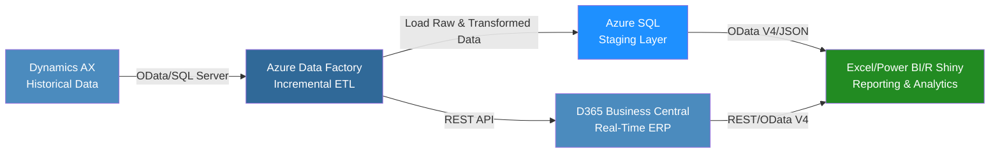

# 🌟 Aeristo Data Integration Case Study & Phased Implementation Plan

---

## 📌 Summary

This document outlines a modern, scalable ETL and data integration strategy for Aeristo, a Dallas-based luxury leather goods company specializing in bespoke interiors for high-end automobiles and private aircraft (e.g., Gulfstream G6, G7). The goal is to integrate legacy data from Microsoft Dynamics AX (pre-2023) with Microsoft Dynamics 365 Business Central (current live data), enabling real-time analytics through Excel, Power BI, and R Shiny applications. The project is structured in three phases—data integration and ETL pipeline setup, reporting and dashboard development, and ongoing optimization—delivering a cloud-native, secure solution as of June 2025.

---

## 📚 Table of Contents

* [Business Problem](#business-problem)
* [Technical Overview](#technical-overview)
* [ETL Strategy & Middleware](#etl-strategy--middleware)
* [Integration Workflow Diagram](#integration-workflow-diagram)
* [Data Consumption for Reporting](#data-consumption-for-reporting)
* [Compatible APIs for R & R Shiny](#compatible-apis-for-r--r-shiny)
* [Phased Implementation Plan](#phased-implementation-plan)
  * [Phase 1: Data Integration and ETL Pipeline Setup](#phase-1-data-integration-and-etl-pipeline-setup)
  * [Phase 2: Reporting and Dashboard Development](#phase-2-reporting-and-dashboard-development)
  * [Phase 3: Optimization and Maintenance](#phase-3-optimization-and-maintenance)
* [Estimated Tooling Costs](#estimated-tooling-costs)
* [Tech Stack](#tech-stack)
* [Conclusion](#conclusion)

---

## 📝 Business Problem

Aeristo relies on two disconnected systems:

* **Microsoft Dynamics AX**: Legacy ERP (pre-2023) storing customer, vendor, sales, and purchasing history (~500K records).
* **Microsoft Dynamics 365 Business Central**: Cloud-based ERP for real-time operations post-2023.

**Key Challenge:** The lack of integration between these systems limits Aeristo’s ability to combine historical and live data, hindering data-driven decisions for inventory management, sales forecasting, and customer insights critical to their luxury leather operations.

---

## ⚙️ Technical Overview

The solution leverages a modern ETL pipeline to:

* Extract historical data from Dynamics AX via SQL Server or OData.
* Transform it to align with Business Central’s schema.
* Load it incrementally to minimize system impact.

**API endpoints enable:**

* R Shiny dashboards for advanced analytics (e.g., demand forecasting).
* Power BI and Excel reports for stakeholder accessibility.

The implementation is divided into three phases:

1. **Phase 1:** Data Integration and ETL Pipeline Setup (3-4 months).
2. **Phase 2:** Reporting and Dashboard Development (2-3 months).
3. **Phase 3:** Optimization and Maintenance (ongoing).

---

## 🛠️ ETL Strategy & Middleware

### 🔄 ETL Process (Incremental)

The ETL process unifies historical and live data:

* **Extract:** Retrieve data from Dynamics AX using SQL Server or OData.
* **Transform:** Align schemas, reformat dates, and tag metadata.
* **Load:** Push transformed data to Business Central via APIs or stage in Azure SQL Database.

### 🧝️‍⚖️ Middleware: Azure Data Factory

* Low-code, cloud-native ETL platform with native connectors.
* Supports incremental loads, automated scheduling, and logging.
* Optional Azure Synapse Analytics integration for advanced transformation.

### ✅ Benefits

* **Cloud-native**: Eliminates on-premises infrastructure.
* **Reporting-ready**: Compatible with Power BI, Excel, and R Shiny.
* **Secure**: Governed by Azure Security Center.

---

## 🧬 Integration Workflow Diagram



This diagram renders correctly in GitHub Markdown when Mermaid is supported and shows the full ETL flow.

---

## 📊 Data Consumption for Reporting

### 📊 How R Shiny Connects and Adds Value

R Shiny delivers interactive dashboards with advanced analytics capabilities, surpassing Power BI in customization for data scientists.

**Benefits for Aeristo:**

* **Real-Time Data:** Connects to Business Central APIs (REST/OData V4) for live updates.
* **Interactive Dashboards:** Enables filtering of sales, inventory, or vendor trends.
* **Advanced Analytics:** Supports forecasting and segmentation models.
* **Deployment:** Host on Azure or internal servers for secure access.
* **Cost-Effective:** Open-source, no per-user licensing fees.

**Excel/Power BI Integration:** Power Query and Power BI connect to Azure SQL or Business Central OData feeds for user-friendly reports.

---

### 🧱 Lightweight Local Storage Option: SQLite

For small-team reporting dashboards or internal proof-of-concept builds, SQLite offers a powerful, file-based alternative to cloud SQL solutions:

- **No Server Needed**: Data stored in a single `.sqlite` file.
- **Perfect for 1–3 Users**: Ideal for analysts or managers viewing reports in a shared drive or browser session.
- **Fast Reads**: Supports complex reads and joins quickly.
- **Easy Setup**: Integrates natively in R with `DBI` and `RSQLite`.
- **No Cost**: Fully open-source and requires no subscription or cloud provisioning.

This is particularly effective for:
- Running Shiny apps on internal networks without Azure App Services.
- Prototyping R dashboards with real Business Central exports via OData feeds.
- Historical reporting where database writes are infrequent.

**⚠ Note:** SQLite is not ideal for multi-user write access or high-concurrency workloads.

#### 📈 Code Snippet
```r
library(DBI)
library(RSQLite)

# Connect to local SQLite DB
con <- dbConnect(RSQLite::SQLite(), "businesscentral.sqlite")

# Run a query
sales <- dbGetQuery(con, "SELECT * FROM SalesInvoices WHERE Year = 2024")

dbDisconnect(con)
```

---

## 💡 Compatible APIs for R & R Shiny

TBD

---

## 🛠️ Phase 1: Data Integration and ETL Pipeline Setup

**Updated Timeline**: **4-6 weeks** (previously 3-4 months)
- **Rationale**: Accelerated timeline leverages pre-built Azure DevOps CI/CD pipelines and modular R scripts for faster integration. The 4-6 week estimate assumes standard data access and stakeholder alignment.
- **Contingency**: The timeline may extend beyond 6 weeks depending on:
  - Availability and responsiveness of Aeristo’s internal teams for data access and validation.
  - Support from the approved Azure DevOps engineer team for pipeline configuration and security compliance.
  - Complexity of ERP data structures or unforeseen API limitations.
  - Additional time may be required for iterative feedback or custom model tuning, potentially adding 2-4 weeks.

... [Remaining content unchanged]


